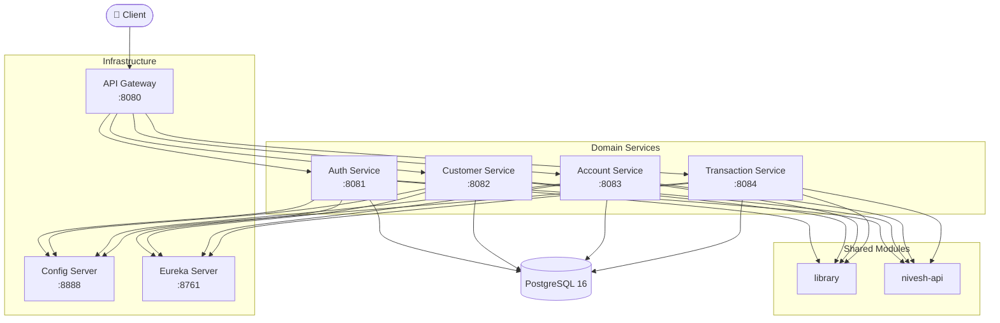

[](https://openjdk.org/projects/jdk/21/)
[](https://spring.io/projects/spring-boot)
[](https://gradle.org/)
[](https://www.postgresql.org/)
[](https://github.com/Roshan1206/Nivesh/commits/main)

# Nivesh Bank

> A production-grade banking microservices platform built with Java 21 and Spring Boot 3.5

---

## About the Project

Nivesh Bank is a self-initiated portfolio project built to go well beyond typical CRUD demos — it implements real-world distributed systems patterns including Choreography Saga for distributed transactions, double-entry bookkeeping enforced at the database level, CIF-based customer identity, OTP-gated fund transfers, and Luhn-protected account numbers. The platform simulates the core operations of a modern retail bank across independently deployable microservices, connected through an API Gateway, Kafka event bus, Redis cache, and Spring Cloud Config. Built by a Senior Java/Spring Boot engineer with 4 years of professional experience, this project is intended to demonstrate the kind of architectural thinking and engineering rigour that matters in production BFSI systems — not just the ability to scaffold a service.

---

## Architecture Overview

All traffic enters through the API Gateway, which validates JWT signatures against the Auth service's JWK endpoint and strips internal headers from external requests. Domain services (Auth, Customer, Account, Transaction) register with Eureka for discovery, pull runtime configuration from the Config Server, and write to their own isolated PostgreSQL schemas. Shared behaviour — JWT utilities, OTP generation, Kafka event DTOs, Luhn validation, and audit entities — lives in `library` (published to `mavenLocal`) and `nivesh-api` (shared DTOs/contracts).



---

## Services

| Service | Port | Responsibility | README | Status        |
|---|---|---|---|---------------|
| API Gateway | 8080 | JWT validation, route filtering, internal header sanitization | [README](gateway/README.md) | ✅ Implemented |
| Auth Service | 8081 | OAuth2 Authorization Server — JWT issuance, refresh tokens, RBAC, token versioning | [README](authentication/README.md) | ✅ Implemented |
| Customer Service | 8082 | Customer registration, KYC onboarding, CIF identity, contact management | [README](customer/README.md) | ✅ Implemented |
| Account Service | 8083 | Account lifecycle, Luhn account numbers, balance management, Saga compensation | [README](account/README.md) | ✅ Implemented |
| Transaction Service | 8084 | OTP-gated fund transfers, Choreography Saga, idempotency, double-entry ledger | [README](transaction/README.md) | ✅ Implemented |
| Config Server | 8888 | Git-backed centralised configuration, RSA key distribution | [README](config/README.md) | ✅ Implemented |
| Eureka Server | 8761 | Service discovery and client-side load balancing | [README](eureka/README.md) | ✅ Implemented |
| library | — | Shared security, JWT/OTP utils, Kafka event DTOs, Luhn, audit entities | [README](library/README.md) | ✅ Implemented |
| nivesh-api | — | Shared API DTOs, request/response contracts | [README](nivesh-api/README.md) | ✅ Added           |

---

## Key Design Patterns

### Choreography Saga — Distributed Transactions

The Transaction Service orchestrates fund transfers across two accounts via Kafka topics. On debit success, it publishes a credit event. If the credit fails, a compensation event triggers a rollback of the debit. Failures beyond the configured retry count are routed to a dead-letter topic and the transaction transitions to `MANUAL_REVIEW`, ensuring no silent money loss.

### Double-Entry Bookkeeping

The `txn` schema enforces double-entry accounting via a PostgreSQL trigger on `journal_entries`: every posted transaction must have exactly one DR row and one CR row with equal amounts. This makes the ledger self-auditing by design rather than by convention.

### CIF-Based Customer Identity

Internal UUIDs never leave the system. Every external API references the 8-character zero-padded CIF number (e.g. `00000042`), a standard BFSI pattern that decouples public identity from internal storage keys.

### JWT / Spring Security Filter Chain

The Auth Service is an OAuth2 Authorization Server using RSA key-pair JWTs (RS256). The Gateway validates signatures against the JWK endpoint and forwards identity downstream. Internal service-to-service calls use `X-Internal-Role: INTERNAL_SERVICE` headers, which the Gateway's `SecurityHeaderFilter` strips from any external request to prevent injection attacks.

### Idempotency with Redis

Every debit/credit operation requires an `idempotencyKey` header. Results are persisted in `idempotency_records` with a 24-hour TTL, so duplicate requests — from retries or network hiccups — replay the original response without re-executing the transaction.

### Optimistic Locking on Balances

The `accounts` table carries a `version` column. Concurrent balance updates trigger `ObjectOptimisticLockingFailureException`, which the service maps to HTTP 429 rather than silently corrupting balance — a pattern appropriate for high-concurrency BFSI workloads.

### OTP-Gated Transactions

Every fund transfer requires a 6-digit OTP verified before money moves. OTPs are stored in Redis with a 5-minute TTL, capped at 3 attempts, and evicted immediately on success or exhaustion.

### Flyway Migrations

Every service manages its own schema lifecycle via Flyway, keeping DDL changes version-controlled, repeatable, and auditable alongside application code.

### Eureka Service Discovery

All domain services self-register with the Eureka Server at startup. The API Gateway performs client-side load balancing via Spring Cloud LoadBalancer, using logical service names rather than hardcoded hosts.

### Spring Cloud Config

Runtime configuration — including Kafka bootstrap servers, mail credentials, token expiry, and Redis settings — is served from a Git-backed repository via the Config Server. Sensitive values are environment-variable interpolated, keeping secrets out of source control.

---

## Tech Stack

| Category | Technology | Version |
|---|---|---|
| Language | Java | 21 |
| Framework | Spring Boot | 3.5 |
| Security | Spring Security / OAuth2 Authorization Server | Spring Cloud 2025.0 |
| Build Tool | Gradle | 8+ |
| Database | PostgreSQL | 16 |
| Migrations | Flyway | Latest compatible with Boot 3.5 |
| Messaging | Apache Kafka | Latest |
| Caching | Redis | Latest |
| Service Discovery | Netflix Eureka (Spring Cloud) | 2025.0 |
| Config | Spring Cloud Config | 2025.0 |
| API Gateway | Spring Cloud Gateway | 2025.0 |
| Containerisation | Docker / Docker Compose | — |

---

## Load Testing / Performance

**Latest run:** Auth Service registration flow (`Initiate Registration → Fetch OTP → Verify Registration`), 1000 concurrent users, 2026-07-06.

| Metric | Result |
|---|---|
| Full flow completions | 903 / 1000 (90.3%) |
| Total errors | 201 / 3000 samples (6.7%) |
| Root cause | HikariCP connection pool exhaustion — pool sized at **10**, confirmed saturated (`active=10, idle=0`) with up to **~189 requests queued** behind it |
| Failure signature | `SQLTransientConnectionException` — every failure traces back to connection-pool saturation, including the earlier cascading 500/404s |

📄 Full report with methodology, percentile breakdowns, and remediation steps: [`test/auth-registration-1000-concurrency.md`](test/auth-registration-1000-concurrency.md)

---

## API Reference

> ⚡ Full API documentation — endpoints, request/response bodies, auth requirements, and error codes — lives in each service's README.

| Service | Base Path | Postman Collection | Full Docs |
|---|---|---|---|
| Auth Service | `/auth` | Coming soon | [README](authentication/README.md) |
| Customer Service | `/customers`, `/kyc` | Coming soon | [README](customer/README.md) |
| Account Service | `/accounts` | Coming soon | [README](account/README.md) |
| Transaction Service | `/transactions` | Coming soon | [README](transaction/README.md) |

**End-to-end flow summary:**

```
1. POST /auth/register              → OTP sent to email
2. POST /auth/register/verify/{id}  → Returns ONBOARDED access token

3. POST /customers                  → Register customer profile
                                      Returns REGISTERED access token

4. POST /kyc                        → Submit KYC document, OTP sent
5. POST /kyc/verify/{id}            → Verify OTP → ACTIVE access token

6. POST /accounts                   → Open bank account (product code: 001)

7. POST /transactions               → Initiate transfer, OTP sent
   Header: idempotencyKey: <uuid>

8. POST /transactions/{id}/verify   → Submit OTP → funds move via Saga
```

---

## Project Structure

```
Nivesh/
├── authentication/          # OAuth2 Authorization Server
├── customer/                # Customer registration & KYC
├── account/                 # Account lifecycle & balance management
├── transaction/             # Fund transfers, Saga, ledger
├── gateway/                 # Spring Cloud Gateway
├── config/                  # Spring Cloud Config Server
├── eureka/                  # Netflix Eureka registry
├── library/                 # Shared library (nivesh-lib)
│   ├── configuration/       # Security, cache, Kafka, audit configs
│   ├── service/             # JWT, OTP, sequence generator
│   ├── dto/                 # Shared request/response/event DTOs
│   ├── entity/              # BaseAudit, shared enums
│   └── util/                # LuhnUtil, validation annotations
├── nivesh-api/              # Shared API DTOs and contracts
├── docker/                  # Docker infrastructure files
├── Nivesh_Bank_Microservices_Architecture.pdf
├── README.md
└── .gitignore
```

---

## Getting Started

### Prerequisites

- Java 21
- Gradle 8+
- PostgreSQL 16
- Redis
- Apache Kafka
- Docker (optional, for infrastructure)

### Clone

```bash
git clone https://github.com/Roshan1206/Nivesh.git
cd Nivesh
```

### Configure

Runtime config is served by the Config Server from a separate Git repo (`nivesh-config`). Before starting services, ensure your environment has:

```bash
export MAIL_ID=your-email@example.com
export MAIL_PWD=your-email-password
```

Or configure `application.yml` in each service directly for local development.

**RSA Keys** — generate and place at:

```bash
openssl genrsa -out private.pem 2048
openssl rsa -in private.pem -pubout -out public.pem
# Place at: authentication/src/main/resources/keys/
```

### Create Database Schemas

```sql
CREATE SCHEMA auth;
CREATE SCHEMA customer;
CREATE SCHEMA account;
CREATE SCHEMA txn;
```

### Run with Docker Compose

```bash
# Start PostgreSQL, Redis, Kafka
docker-compose up -d
```

> A `docker-compose.yml` covering all infrastructure is located in the `docker/` folder.

### Run Services Individually

Start in this order — Config and Eureka must be up before domain services:

```bash
# 1. Publish shared library
cd library && ./gradlew publishToMavenLocal

# 2. Config Server
cd config && ./gradlew bootRun

# 3. Eureka
cd eureka && ./gradlew bootRun

# 4. Auth Service
cd authentication && ./gradlew bootRun

# 5. Domain services (any order)
cd customer && ./gradlew bootRun
cd account && ./gradlew bootRun
cd transaction && ./gradlew bootRun

# 6. Gateway (last)
cd gateway && ./gradlew bootRun
```

### Health Check URLs

| Service | Health Endpoint                              |
|---|----------------------------------------------|
| API Gateway | http://localhost:8080/nivesh/actuator/health |
| Auth Service | http://localhost:8081/actuator/health        |
| Customer Service | http://localhost:8082/actuator/health        |
| Account Service | http://localhost:8083/actuator/health        |
| Transaction Service | http://localhost:8084/actuator/health        |
| Config Server | http://localhost:8888/actuator/health        |
| Eureka Dashboard | http://localhost:8761                        |

---

## Roadmap

### Done

- [x] API Gateway — JWT validation, route filtering, internal header sanitization
- [x] Auth Service — OAuth2 Authorization Server, RSA JWT, refresh tokens, token versioning, RBAC with per-user permission overrides
- [x] Customer Service — registration, CIF number generation, KYC document submission/verification, OTP flow
- [x] Account Service — account creation, Luhn-protected 11-digit account numbers, balance debit/credit, optimistic locking, Saga compensation endpoints
- [x] Transaction Service — OTP-gated transfers, Choreography Saga, idempotency, double-entry journal entries
- [x] Config Server — Git-backed centralised configuration
- [x] Eureka Server — service discovery
- [x] Shared Library — JWT, OTP, Luhn, Kafka event DTOs, audit base entities
- [x] Flyway migrations (schema-per-service)
- [x] Gradle multi-module build
- [x] Docker infrastructure setup
- [x] Kafka + Debezium Outbox Pattern for guaranteed event delivery

### Planned

- [ ] Payments Service (:8085) — UPI, NEFT, RTGS, IMPS rails
- [ ] Loans Service (:8086)
- [ ] Cards Service (:8087)
- [ ] Notifications Service (:8088) — Kafka-driven email/SMS
- [ ] Fraud Service (:8089) — real-time transaction scoring
- [ ] Reporting Service (:8090)
- [ ] Audit Service (:8091)
- [ ] Investment Service (:8092)
- [ ] Branch & ATM Service (:8093)
- [ ] Cassandra for transaction history older than 90 days (cold storage tiering)
- [ ] HashiCorp Vault for secrets management
- [ ] Distributed tracing (Micrometer + Zipkin)
- [ ] PostGIS for branch geolocation and 5 km radius constraint
- [ ] Kubernetes manifests + Helm charts

---

## Author

**Roshan Lal Sahu** — Senior Software Engineer (Java / Spring Boot / Microservices)

[LinkedIn](https://linkedin.com/in/roshansahu96) · [GitHub](https://github.com/Roshan1206)

---

> Built to demonstrate production-grade microservices architecture patterns: Choreography Saga, double-entry bookkeeping, OTP-gated transactions, idempotency, optimistic concurrency, RBAC with permission overrides, distributed caching, and event-driven compensation flows.
