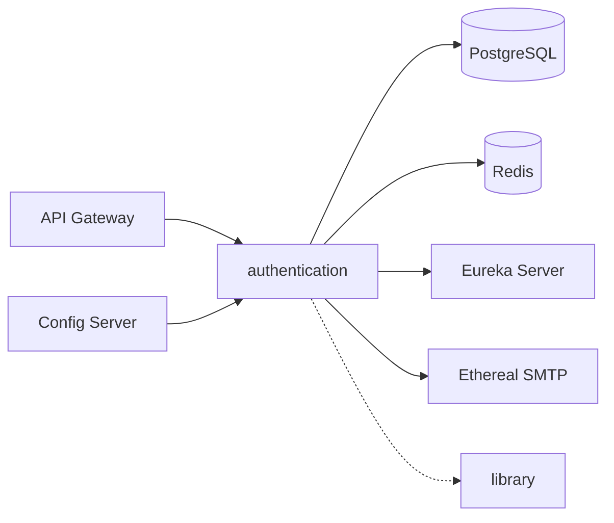

# Authentication Service — Nivesh Bank

Part of [Nivesh Bank](https://www.google.com/search?q=../README.md)

## 2. What This Service Does

The Authentication Service acts as the central identity and access management (IAM) provider for the Nivesh Bank platform. It leverages Spring Authorization Server to handle user registration, secure login via BCrypt hashing, JWT access token issuance, and refresh token rotation. Furthermore, it maintains an extensive Role-Based Access Control (RBAC) model, complete with stage-based customer roles, granular permission mappings, and an append-only audit trail for compliance tracking.

## 3. Architecture Position

## 4. Key Design Patterns

### Role-Based Access Control (RBAC) with Overrides

* **What it is:** A comprehensive security model that assigns permissions through roles, while allowing specific grants/revokes at the user level.
* **Where:** Database schema (`user_roles`, `role_permissions`, `user_permission_overrides`) and `SecurityConfiguration`.
* **Why:** Essential for banking compliance. It allows a customer to naturally progress through stages (e.g., `CUSTOMER_REGISTERED` to `CUSTOMER_ACTIVE`) and permits admins to temporarily freeze specific actions without changing the core role.

### Append-Only Audit Trail

* **What it is:** An immutable record of critical state changes.
* **Where:** `user_role_history` table in `V1__table_design_and_seeding.sql`.
* **Why:** Required for financial and security audits. It ensures that every role assignment or removal (e.g., KYC approvals, manual grants) is permanently logged with the trigger reason and acting authority.

### Controller Advice / Global Exception Handling

* **What it is:** Centralized handling of exceptions thrown by controllers.
* **Where:** `ExceptionalHandler.java` (as seen in package structure) intercepting exceptions from `AuthController` and `UserController`.
* **Why:** Standardizes error responses across the entire REST API, ensuring that internal stack traces are never exposed to the client.

## 5. Database Schema

| table_name | what it does |
| --- | --- |
| `oauth2_registered_client` | Spring Authorization Server table: Stores registered OAuth2 clients. |
| `oauth2_authorization` | Spring Authorization Server table: Stores active OAuth2 authorizations and tokens. |
| `oauth2_authorization_consent` | Spring Authorization Server table: Stores user consent details for scopes. |
| `users` | Core identity table storing credentials, lockouts, and status. Passwords are BCrypt hashed. |
| `roles` | Defines system and customer roles (e.g., `SUPER_ADMIN`, `CUSTOMER_ACTIVE`). |
| `permissions` | Defines granular actions formatted as `SVC:RESOURCE:ACTION`. |
| `refresh_tokens` | Tracks issued refresh tokens, their expiry, and revocation status. |
| `role_permissions` | Maps roles to their default set of permissions. |
| `user_roles` | Associates users with their assigned roles (supports multiple simultaneous roles). |
| `user_role_history` | Append-only audit table tracking every role assignment or removal. |
| `user_permission_overrides` | Grants or revokes specific permissions for a user on top of their role defaults. |

## 6. API Reference

### Auth Endpoints

| Method | Path | Auth | Description |
| --- | --- | --- | --- |
| POST | `/auth/register` | None | Initiates user registration and sends an OTP. Returns a request ID. |
| POST | `/auth/register/verify/{requestId}` | None | Verifies the OTP sent during registration. Returns initial tokens. |
| POST | `/auth/login` | None | Authenticates user via email/password and returns JWT access/refresh tokens. |
| POST | `/auth/refresh` | None | Issues a new access token using a valid refresh token. |
| POST | `/auth/forgot/initiate` | None | Initiates a password reset process and dispatches an OTP. |
| POST | `/auth/forgot/verify/{requestId}` | None | Verifies the password reset OTP. |
| PATCH | `/auth/forgot/reset/{requestId}` | None | Finalizes the password reset using the provided new password. |

### User Endpoints

| Method | Path | Auth | Description |
| --- | --- | --- | --- |
| POST | `/user/reset` | Bearer | Resets the password for the currently authenticated user. |
| POST | `/user/logout` | Bearer | Revokes the active refresh token and logs the user out of the current session. |
| POST | `/user/logout/all` | Bearer | Revokes all active tokens for the user and increments their token version (global sign-out). |
| POST | `/user/internal/{userId}/{status}` | Internal | Private endpoint for system services to update a user's status (e.g., post-KYC). |

## 7. Configuration

| Property | Default / Example Value | Description |
| --- | --- | --- |
| `server.port` | `8081` | Service operating port |
| `nivesh.auth.database.schema` | `auth` | PostgreSQL schema used by Flyway and JPA |
| `spring.datasource.url` | `jdbc:postgresql://localhost:5432/nivesh?currentSchema=auth` | Database connection string |
| `nivesh.auth.token.access-expiry` | `15` | Expiry time for access tokens (in minutes) |
| `nivesh.auth.cache.max-attempts` | `3` | Number of failed login attempts before lockout |
| `spring.mail.host` | `smtp.ethereal.email` | SMTP host for dispatching OTP emails |
| `spring.data.redis.host` | `localhost` | Redis host for caching and token management |

## 8. Shared Module Dependencies

### library

* **`com.nivesh.library.dto.response.OtpResponse`**: Used in `AuthController` to standardize OTP request tracking across the platform.

### nivesh-api

* No direct dependencies visible in the core auth controllers; auth currently relies on local DTOs (`RegisterRequest`, `LoginRequest`, `TokenResponse`).

## 9. Running This Service Locally

1. Prerequisites: Java 21, PostgreSQL 16, Redis, and Eureka Server running.
2. Clone: `git clone https://github.com/Roshan1206/Nivesh.git && cd Nivesh`
3. Ensure PostgreSQL database `nivesh` is running with user `postgres` and password `password`.
4. Build: `./gradlew :authentication:bootJar`
5. Run: `./gradlew :authentication:bootRun`
6. Verify: `curl http://localhost:8081/actuator/health`

## 10. Known Limitations / WIP

* 🚧 **Token Blacklisting**: Currently relies entirely on token versioning and refresh token revocation. Granular JWT blacklisting in Redis for mid-flight access tokens is planned.
* 🚧 **Rate Limiting**: Missing API gateway-level or service-level rate limiting on the `/auth/login` endpoint to aggressively prevent brute force attacks prior to the database lockout logic.
* 📋 **Production SMTP**: Currently hardcoded to Ethereal Mail for testing. Needs a production-grade provider (e.g., AWS SES, SendGrid) integration.

## 11. Back to Root

> This service is part of [Nivesh Bank](https://www.google.com/search?q=../README.md) — a production-grade Java 21 / Spring Boot 3.x microservices banking platform.
