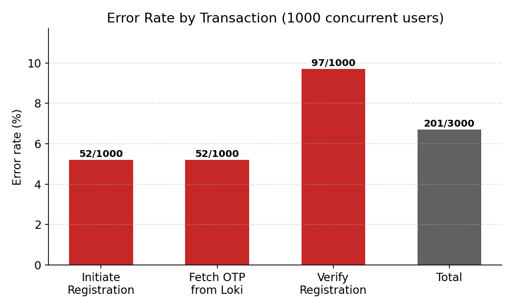
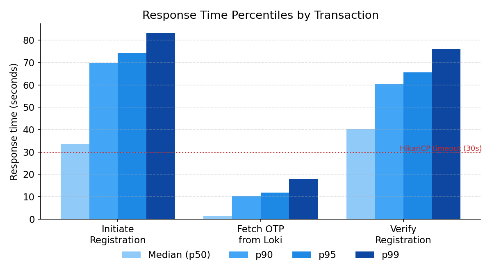
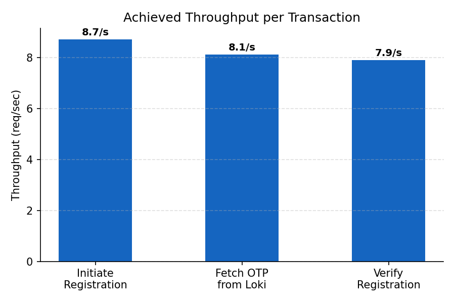
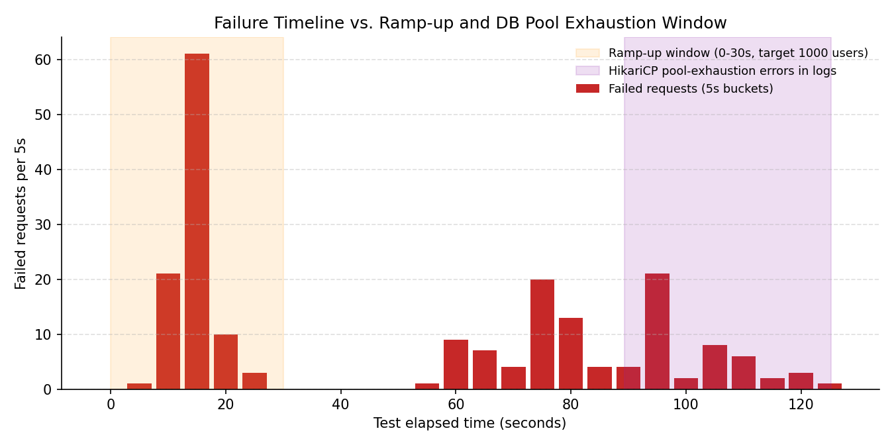

# Load Test Report: Auth Service — Registration Flow (1000 Concurrent Users)

**Test plan:** `auth-registration-1000-concurrency.jmx`
**Service under test:** `authentication` (port 8081)
**Date:** 2026-07-06, 17:42–17:44 IST
**Tooling:** Apache JMeter (BlazeMeter Concurrency Thread Group) · Grafana Loki (log correlation) · HikariCP connection pool metrics

---

## 1. Objective

Validate the Auth Service registration flow (`Initiate Registration → Fetch OTP → Verify Registration`) under a sustained load of **1000 concurrent virtual users**, and identify the bottleneck limiting throughput and reliability.

## 2. Test Configuration

| Parameter | Value |
|---|---|
| Thread group type | BlazeMeter Concurrency Thread Group |
| Target concurrency | 1000 users |
| Ramp-up | 30 s (10 steps) |
| Hold | 180 s |
| Iterations per user | 1 |
| Flow under test | `Initiate Registration` → `Fetch OTP from Loki` → `Verify Registration` |
| Actual test duration | ~125 s (ended early — see §4.3) |

## 3. Results Summary

| Transaction | Samples | Errors | Error % | Mean | Median | p90 | p95 | p99 | Throughput |
|---|--:|--:|--:|--:|--:|--:|--:|--:|--:|
| Initiate Registration | 1000 | 52 | 5.2% | 35.7 s | 33.6 s | 69.8 s | 74.4 s | 83.2 s | 8.72/s |
| Fetch OTP from Loki | 1000 | 52 | 5.2% | 3.4 s | 1.5 s | 10.3 s | 11.9 s | 17.8 s | 8.13/s |
| Verify Registration | 1000 | 97 | 9.7% | 38.4 s | 40.1 s | 60.5 s | 65.7 s | 76.1 s | 7.92/s |
| **Total** | **3000** | **201** | **6.7%** | 25.8 s | 17.6 s | 62.2 s | 69.0 s | 79.3 s | 21.73/s |



The spread between median and tail latency is significant: Initiate Registration shows a 33.6 s median against an 83.2 s p99. This distribution — a subset of requests completing quickly while the remainder degrades sharply — is consistent with contention for a shared, finite resource (thread pool, connection pool, or lock) rather than uniformly slow processing.





## 4. Root Cause Analysis

### 4.1 Confirmed: HikariCP connection pool exhaustion

Grafana Loki logs for the `auth` container show 17 occurrences of `SQLTransientConnectionException`, all with the same signature:

```
HikariPool-1 - Connection is not available, request timed out after 30000ms
(total=10, active=10, idle=0, waiting=188)
```

This is direct, unambiguous evidence, not an inference:
- **Pool size = 10** (`total=10`) — confirmed configured maximum, not assumed.
- **All 10 connections busy continuously** (`active=10, idle=0`) for the entire window these errors were logged.
- **Up to 189 requests queued** behind those 10 connections (`waiting=189`), each waiting the full 30 s Hikari timeout before failing.

These errors are clustered tightly between **t+89s and t+125s** of the test (i.e., during the sustained "hold" phase, not the ramp-up), and this window lines up almost exactly with the second wave of failures seen in the JTL results — the 45 `Verify Registration` HTTP 500s and the tail of the `Fetch OTP from Loki` / `Verify Registration` failures.



A connection pool configured at 10 connections against 1000 concurrent callers exceeded capacity as soon as sustained load began; the exhaustion observed here was a predictable outcome of that configuration relative to the offered load, not an anomaly.

### 4.2 Cascading failures downstream of an earlier, separate spike

The numbers resolve unusually cleanly once split into two groups:

| Error | Count | When (test elapsed) |
|---|--:|---|
| Initiate Registration → HTTP 500 | 52 | 0–30 s (ramp-up) |
| Fetch OTP from Loki → failed (no OTP found) | 52 | throughout |
| Verify Registration → HTTP 404 (nothing to verify) | 52 | throughout |
| Verify Registration → HTTP 500 (DB timeout) | 45 | 89–125 s (pool exhaustion window) |
| **Total** | **201** | matches reported total exactly |

52 + 52 + 52 + 45 = 201. This is not coincidental — it indicates that every one of the 52 initial `Initiate Registration` failures cascades: no user/OTP is ever created, so the corresponding `Fetch OTP from Loki` step finds nothing, and the corresponding `Verify Registration` step 404s. Those 156 errors are three symptoms of one initial trigger, not three separate problems.

## 5. Recommendations

1. **Right-size the HikariCP pool** against actual DB core count / IOPS — likely 15–20, not a blind bump to 50+ (that just moves the bottleneck to Postgres itself).
2. **Add a queue/circuit breaker in front of the pool** (Resilience4j `Bulkhead` + `CircuitBreaker`) so requests fail fast (e.g., 429) once the pool is saturated, instead of every caller waiting the full 30 s only to fail anyway.
3. **Reduce per-transaction connection hold time** in `Initiate Registration` / `Verify Registration` — check for connections held open across external calls (OTP generation, Loki writes) rather than released immediately after the DB write.
4. **Re-pull the missing Loki window** (§4.3) to close out the open item before calling this fully root-caused.
5. **Alert on `HikariPool active == total`** sustained for >5 s in Grafana — this is the earliest reliable signal of the failure mode, well before timeouts start cascading into user-facing errors.

## 6. Artifacts

- Test plan: `auth-registration-1000-concurrency.jmx`
- Raw results: `results.jtl`
- Charts: [`./charts/`](./auth-registration-1000-concurrency/charts/)
